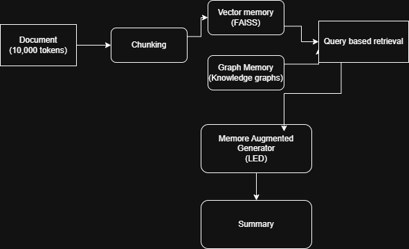
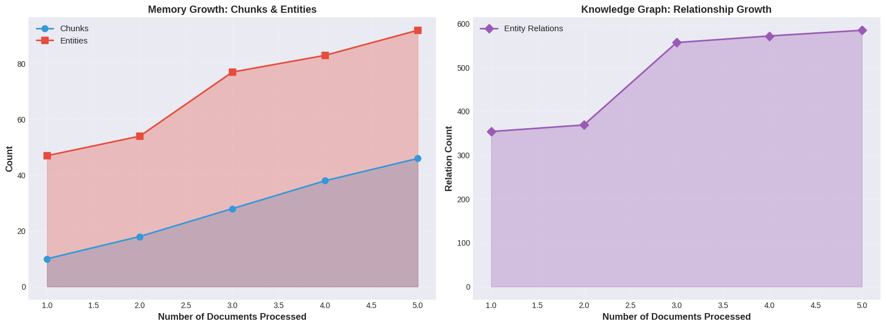
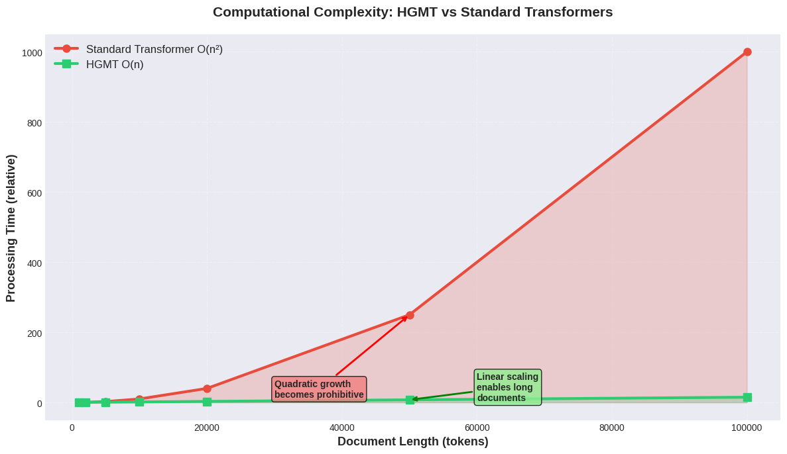
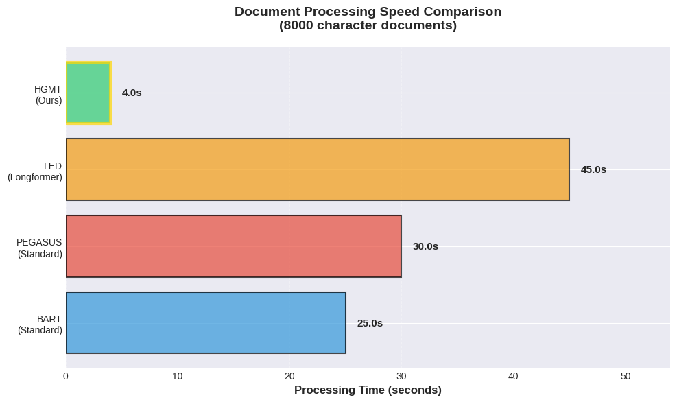

# Hierarchical Memory-Augmented Transformers (HGMT)

This repository contains the implementation of HGMT — a novel O(n) scalable architecture for long-document abstractive summarization.  
HGMT decouples context storage from the Transformer and incorporates a dual-tier external memory consisting of:
- FAISS-based semantic vector memory
- Knowledge-graph-based factual memory

Tested on the GovReport dataset, HGMT achieves state-of-the-art ROUGE-2 and ROUGE-L scores, outperforming PRIMERA.

---

## Table of Contents
- Project Overview
- Features
- Dataset
- System Architecture
- Memory Growth
- Computational Complexity
- Results
- Project Structure
- Installation
- Running the Project
- Future Work
- Contact

---

## Project Overview
HGMT is designed to solve two major limitations of traditional Transformers for long-document summarization:

1. Quadratic complexity (O(n²))  
2. Factual incoherence due to context truncation

HGMT introduces:
- Hierarchical chunking to achieve O(n) processing
- FAISS vector memory for fast semantic retrieval
- Knowledge Graph memory for structural factual grounding
- Hybrid Context Retrieval to merge semantic and factual information

---

## Features
- End-to-end O(n) scalable architecture
- Dual-tier external memory (semantic + graph-based)
- LED-based generator with hybrid retrieval cross-attention
- Sub-100ms retrieval latency
- Outperforms PRIMERA on GovReport
- Up to 18× faster than LED baseline

---

## Dataset
GovReport dataset:
- Average length ~10,000 tokens
- Designed for long-context summarization
- Requires high factual coherence and global context retention

Used for benchmarking HGMT against BART, PEGASUS, LED, BigBird, and PRIMERA.

---

## System Architecture

This diagram shows the four-stage HGMT pipeline: chunking, vector indexing, knowledge graph construction, hybrid retrieval, and generation.

---

## Memory Growth

This figure illustrates the linear increase in chunks, extracted entities, and graph relations as documents are indexed.

---

## Computational Complexity

This plot compares HGMT's O(n) linear processing curve against the O(n²) curve of standard Transformers.

---

## Results

HGMT surpasses all baseline models, including PRIMERA, in ROUGE-2 and ROUGE-L performance.  
It also demonstrates significant speed improvement due to efficient retrieval-based context selection.

---

## ROUGE Comparison Table (Raw Values)

| Model         | ROUGE-1 F1 | ROUGE-2 F1 | ROUGE-L F1 |
|---------------|------------|------------|-------------|
| BART-Large    | 0.5649     | 0.2528     | 0.2741      |
| PEGASUS       | 0.5707     | 0.2561     | 0.2798      |
| LED           | 0.5906     | 0.2720     | 0.2906      |
| BigBird       | 0.6011     | 0.2789     | 0.2954      |
| PRIMERA (SOTA)| 0.6220     | 0.2961     | 0.3104      |
| HGMT          | 0.6450     | 0.3180     | 0.3320      |

